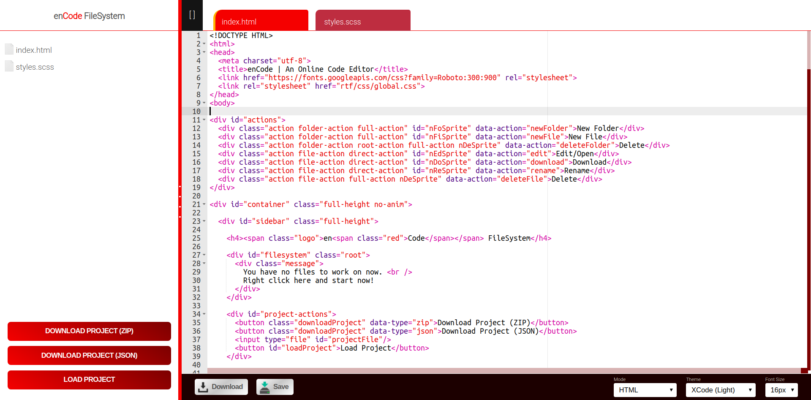

# enCode Code Editor

This is a simple code editor I made to test my JavaScript skills a few years back.

It works best in Chrome.

## Features

* Syntax Highlighting (supports almost every language)
* Local storage of code in browser
* Downloadable formats: zip & json
* Loadable project from downloaded json file
* Themes (Multiple Dark and Light modes)
* Each file can be individually downloaded
* FullScreen (`Alt+F`)

The code is minified, hence it isn't that readable.
I lost the main version due to hard disk failure, this was the hosted, minified version I was left with.
